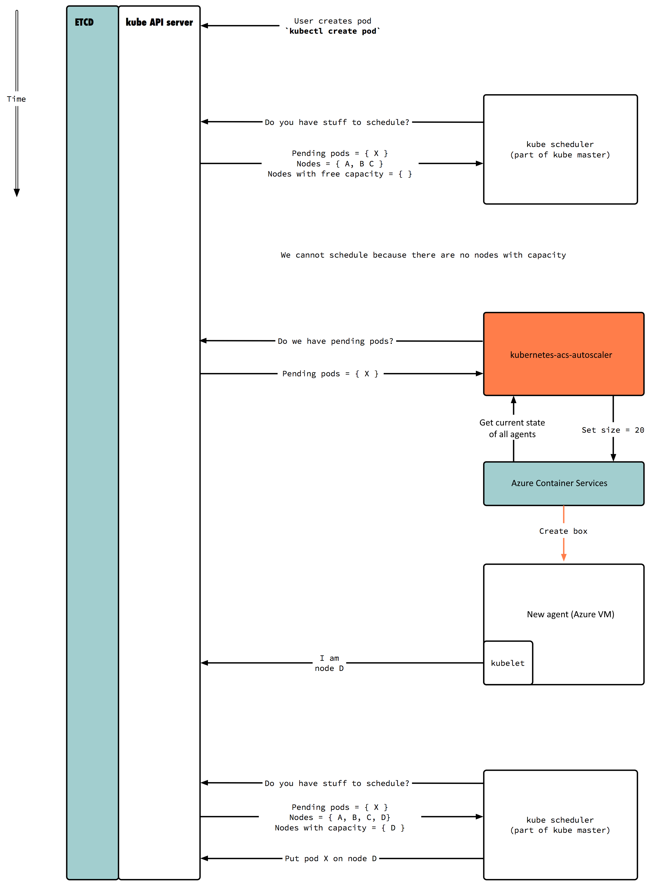

 :star2: This project is a fork of [OpenAI](https://openai.com/blog/)'s [Kubernetes-ec2-autoscaler](https://github.com/openai/kubernetes-ec2-autoscaler)  
 
:warning: **ACS is not supported, this autoscaler is for [`acs-engine`](https://github.com/azure/acs-engine) only** :warning:

:information_source: If you need autoscaling for VMSS, check out [OpenAI/kubernetes-ec2-autoscaler:azure](https://github.com/openai/kubernetes-ec2-autoscaler/tree/azure) or [cluster-autoscaler](https://github.com/kubernetes/contrib/tree/master/cluster-autoscaler)


# kubernetes-acs-engine-autoscaler

kubernetes-acs-engine-autoscaler is a node-level autoscaler for [Kubernetes](http://kubernetes.io/) for clusters created with acs-engine.  
Kubernetes is a container orchestration framework that schedules Docker containers on a cluster, and kubernetes-acs-autoscaler can scale based on the pending job queue.

## Architecture



## Setup

The autoscaler can be run anywhere as long as it can access the Azure
and Kubernetes APIs, but the recommended way is to set it up as a
Kubernetes Pod.

### Credentials

You need to provide a Service Principal to the autoscaler.
You can create one using [Azure CLI](https://github.com/Azure/azure-cli):  
`az ad sp create-for-rbac`

The best way to use the access key in Kubernetes is with a [secret](http://kubernetes.io/docs/user-guide/secrets/).

Here is a sample format for `secret.yaml`:
```
apiVersion: v1
kind: Secret
metadata:
  name: autoscaler
data:
  azure-sp-app-id: [base64 encoded app id]
  azure-sp-secret: [base64 encoded secret access key]
  azure-sp-tenant-id: [base64 encoded tenand id]
```
You can then save it in Kubernetes:
```
$ kubectl create -f secret.yaml
```

### Run in-cluster
[scaling-controller.yaml](scaling-controller.yaml) has an example
[Replication Controller](http://kubernetes.io/docs/user-guide/replication-controller/)
that will set up Kubernetes to always run exactly one copy of the autoscaler.
To create the Replication Controller:
```
$ kubectl create -f scaling-controller.yaml
```
You should then be able to inspect the pod's status and logs:
```
$ kubectl get pods -l app=autoscaler
NAME               READY     STATUS    RESTARTS   AGE
autoscaler-opnax   1/1       Running   0          3s

$ kubectl logs autoscaler-opnax 
2016-08-25 20:36:45,985 - autoscaler.cluster - DEBUG - Using kube service account
2016-08-25 20:36:45,987 - autoscaler.cluster - INFO - ++++++++++++++ Running Scaling Loop ++++++++++++++++
2016-08-25 20:37:04,221 - autoscaler.cluster - INFO - ++++++++++++++ Scaling Up Begins ++++++++++++++++
...
```

### Running locally
```
$ docker build -t autoscaler .
$ ./devenvh.sh
#in the container
$ python main.py --resource-group k8s --service-principal-app-id 'XXXXXXXXX' --service-principal-secret 'XXXXXXXXXXXXX' service-principal-tenant-id 'XXXXXX' --dry-run -vvv --kubeconfig /root/.kube/config --template-file azuredeploy.json --parameters-file azuredeplou.parameters.json
```


## Full List of Options

```
$ python main.py [options]
```
- --resource-group: Name of the resource group containing the cluster
- --template-file: Full path to the ARM template file (if stored locally or on a Persistent Volume).
- --template-file-url: URL to the ARM template file (if accessed via a URL).  
- --parameters-file: Full path to the ARM parameters file (if stored locally or on a Persistent Volume). 
- --parameters-file-url: URL to the ARM parameters file (if accessed via a URL).
- --kubeconfig: Path to kubeconfig YAML file. Leave blank if running in Kubernetes to use [service account](http://kubernetes.io/docs/user-guide/service-accounts/).
- --service-principal-app-id: Azure service principal id. Can also be specified in environment variable `AZURE_SP_APP_ID`
- --service-principal-secret: Azure service principal secret. Can also be specified in environment variable `AZURE_SP_SECRET`
- --service-principal-tenant-id: Azure service princiap tenant id. Can also be specified in environment variable `AZURE_SP_TENANT_ID`
- --over-provision: Number of cluster agents to over provision in anticipation for imminent load
- --sleep: Time (in seconds) to sleep between scaling loops (to be careful not to run into AWS API limits)
- --slack-hook: Optional [Slack incoming webhook](https://api.slack.com/incoming-webhooks) for scaling notifications
- --dry-run: Flag for testing so resources aren't actually modified. Actions will instead be logged only.
- -v: Sets the verbosity. Specify multiple times for more log output, e.g. `-vvv`
- --debug: Do not catch errors. Explicitly crash instead.
